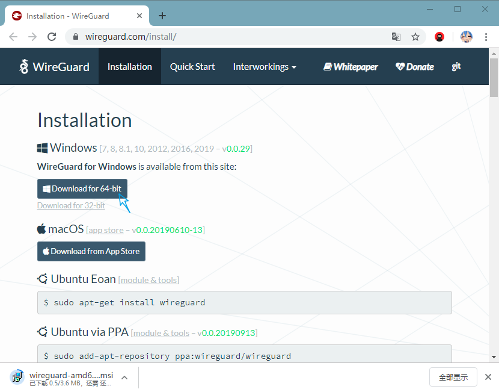
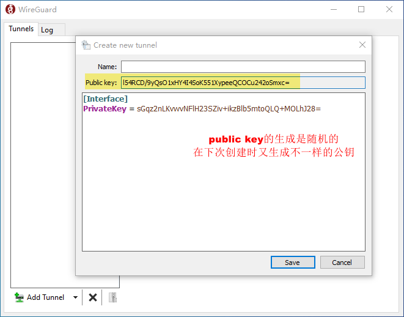
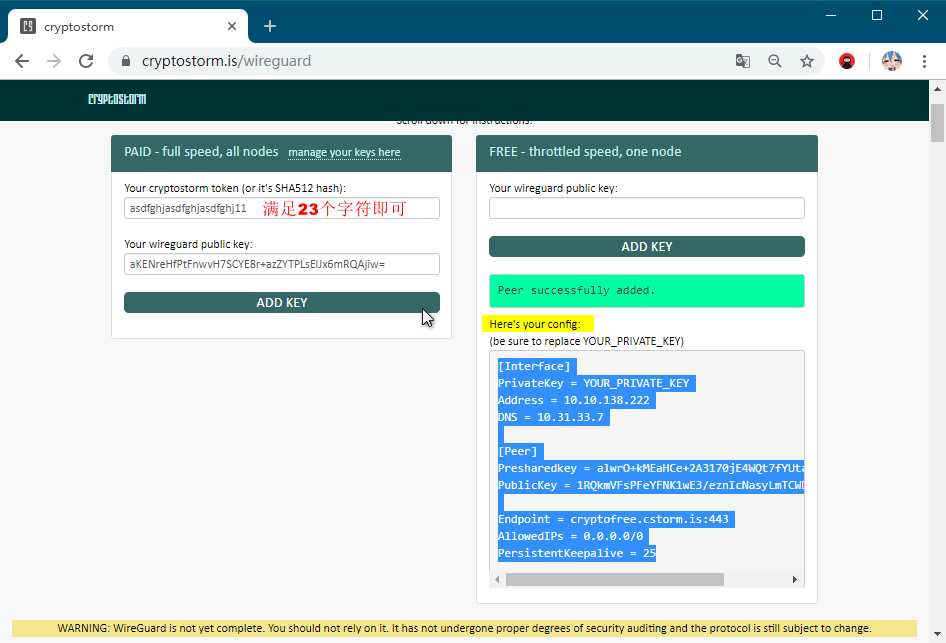
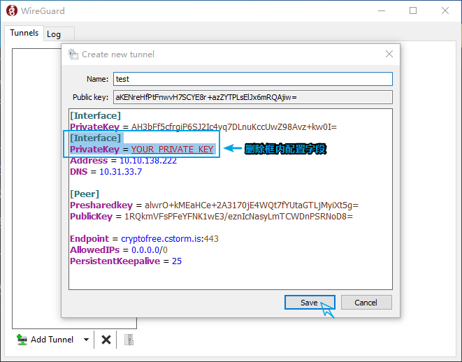
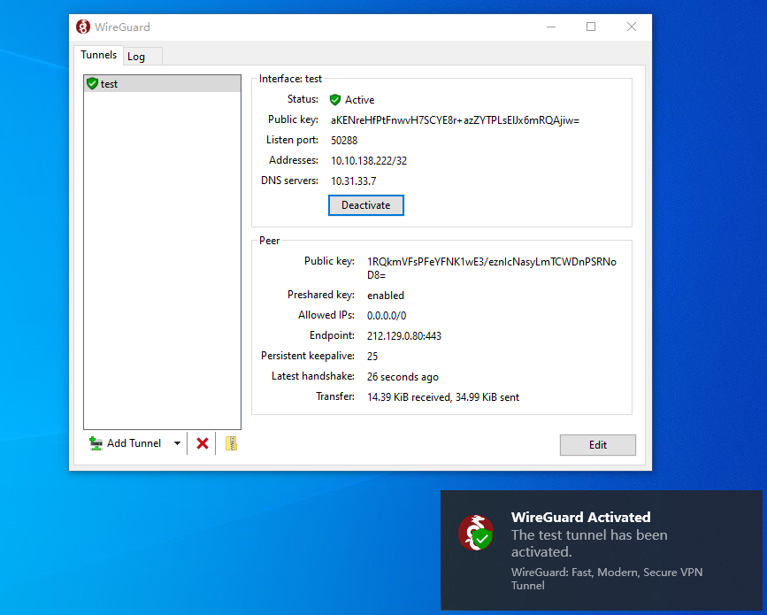
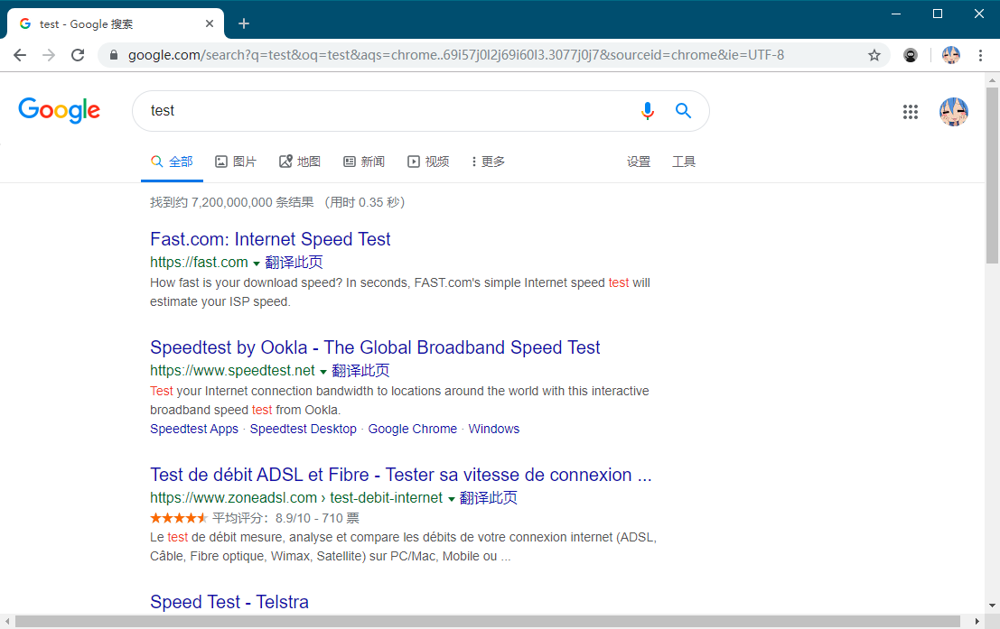

# wireguard

进入[wireguard](https://www.wireguard.com/install/)，下载



打开wireguard选择 `add empty tunnel`并复制`public key` 公钥键值



进入[cryptostorm.is/wireguard](https://cryptostorm.is/wireguard)，将公钥复制到`your wireguard public key`选项，`add key`继续，并生成的配置文件



将配置文件复制到`public key`下方配置信息框内，并删除如下不必要的字段

```
[Interface]
PrivateKey = YOUR_PRIVATE_KEY
```



点击`active`激活



测试



> 参考自油管 [Siemens Tutorials](https://www.youtube.com/channel/UCmvvn2qsP77_7XUB0omMeCw/about?pbjreload=10) 关于wireguard翻墙视频